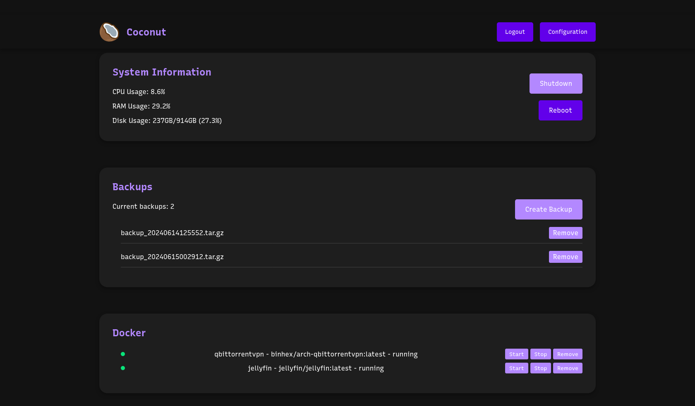

# Coconut

## Overview
Simple, lightweight and self-hosted Home Server management.

## Preview


## Features
- Read System Information
- Manage Docker Containers
- Create Backup
- Shutdown
- Reboot

## Technologies
- **Backend**: Flask
- **Frontend**: Vue.js, SCSS
- **Database**: *soon*

## Requirements
- Python 3.8+
- Node.js 20+

## Installation
**Clone the repository**
```bash
git clone https://github.com/ximmanuel/Coconut.git
cd Coconut
```

**Create a virtual environment**
```bash
python -m venv .venv
```

**Activate the virtual environment**

Linux
```bash
source .venv/bin/activate
```

Fish
```bash
source .venv/bin/activate.fish
```

**Install dependencies**
```bash
pip install -r requirements.txt
```

**Copy .env.example to .env and edit it**
```bash
cp .env.example .env
```

**Run the server**
```bash
python app.py
```

## Development

**Install frontend dependencies**
```bash
cd coconut-shell/
npm install
```

**Build frontend**
```bash
python build.py
```


## License
This project is licensed under the MIT License - see the [LICENSE](LICENSE) file for details.
